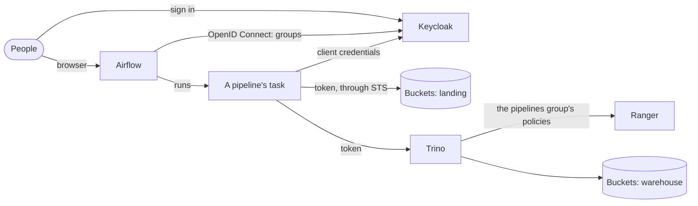

# Apache Airflow on Buckets, with Keycloak for people and pipelines

This guide puts Apache Airflow on the [lakehouse](lakehouse.md) (Buckets, Nessie, Trino, Apache Ranger, Keycloak), with the same identity throughout, for people and for pipelines:
- **People** sign in to Airflow with **Keycloak**. Their Keycloak groups are their Airflow roles: engineers operate pipelines, analysts watch them, and anyone in neither group is refused.
- **Pipelines** run as an identity of their own: a Keycloak **service account**, in a `pipelines` group. They don't run as whoever triggered them. Each task gets a short-lived token for the service account, and:
  - in **Buckets** it exchanges the token through STS for temporary credentials, under the `pipelines` policy (the `landing` bucket, and nothing else);
  - in **Trino** it signs in with the same token, so **Ranger** applies the `pipelines` group's policies and audits the service account by name.
- **Airflow keeps one secret:** the service account's Keycloak client secret, encrypted in its database. It stores no S3 keys and no Trino password.

Everything runs from [`examples/airflow`](../../examples/airflow), which includes the lakehouse stack. A test script checks what this guide says the stack does: it signs people in through Keycloak's login form, triggers the pipeline through Airflow's API, and checks where its work landed and as whom. CI runs it on each change to Buckets.

| Component | Version | Role |
|---|---|---|
| Apache Airflow | 3.3.2: API server, scheduler, DAG processor; LocalExecutor; Postgres | Pipelines, and their UI |
| FAB auth manager | `apache-airflow-providers-fab` 3.9 (Flask-AppBuilder, Authlib) | Airflow's Keycloak sign-in, groups as roles |
| Trino, Apache Ranger, Nessie, Buckets, Keycloak | as in the [lakehouse](lakehouse.md) | The lakehouse the pipelines load |

## How it fits together



| | `analysts` (alice) | `engineers` (bob) | Neither (carol) | The pipelines (service account) |
|---|---|---|---|---|
| Airflow | Viewer: sees DAGs, runs, logs | Op: also triggers and clears runs, sees connections | Refused | n/a |
| Buckets `landing` | No | No | No | Read and write, through STS |
| Buckets `warehouse` | No | No | No | No: Trino writes the tables |
| `iceberg.sales.orders` in Trino | EU rows, masked (as in the lakehouse) | Everything | Nothing | Read, insert, delete |

**Why pipelines get their own identity.** A scheduled run has nobody behind it, and a triggered run shouldn't be able to do whatever the person who triggered it can. A service account per pipeline team gives every run the same, narrow permissions, in Buckets and in Ranger. The audit logs then say which pipelines did what. Removing a group or rotating the client secret in Keycloak takes effect at the next task.

## Run it

You need Docker with Compose 2.24 or later, and about 7 GB of memory for Docker.

```bash
cd examples/airflow
docker compose up -d --wait        # the lakehouse, plus Airflow; about a minute once built
docker compose run --rm test
```

```
ok   people sign in to Airflow with Keycloak  (bob signed in, alice signed in)
ok   people in neither group can't sign in  (carol got no session token)
ok   the pipeline is loaded  (sales_ingest)
ok   analysts (Viewer) can't trigger a pipeline  (alice: HTTP 403)
ok   engineers (Op) trigger it  (bob: HTTP 200, run manual__2026-10-06T14:13:16.652020+00:00)
ok   bob's run succeeds  (state success)
ok   its tasks ran in Trino as the pipelines' service account, not as bob  (current_user: service-account-airflow-pipelines)
ok   ... and landed its file in Buckets with STS credentials, landing/ only  (sales/orders-manual__2026-10-06T14-13-16.652020-00-00.csv; the same credentials on warehouse: AccessDenied)
ok   the orders it loaded are in the lakehouse  (2 new orders in iceberg.sales.orders, 8 in all)
ok   Ranger's audit log records the pipeline's queries under the service account  (8 allowed requests by service-account-airflow-pipelines)
ok   Airflow holds no S3 keys or Trino password: one Keycloak client  (keycloak_pipelines (http))

all checks passed
```

`docker compose down -v` stops everything and deletes the data. The passwords are in `.env` and `../lakehouse/.env`, and all of them are for local use only. Run one example at a time: they use the same ports.

**In a browser:** add `127.0.0.1 keycloak airflow` to your hosts file, open http://airflow:8090, and sign in with Keycloak as `alice` or `bob`.

## The pipeline

`dags/sales_ingest.py` has two tasks:
- **`land_orders`** writes a CSV of new orders to `s3://landing/sales/orders-<run>.csv`. It also tries to list the `warehouse` bucket with the same credentials, which Buckets refuses, and records that.
- **`load_orders`** reads the file back and loads its orders into `iceberg.sales.orders` through Trino. It records `current_user`, the number of rows, and the table's total.

Both tasks get their identity from `dags/lakehouse_identity.py`:

```python
def token():                       # the service account's token: client credentials
    c = BaseHook.get_connection("keycloak_pipelines")
    r = requests.post(f"http://{c.host}:{c.port}/realms/lakehouse/protocol/openid-connect/token",
                      data={"grant_type": "client_credentials", "client_id": c.login, "client_secret": c.password})
    return r.json()["access_token"]

def buckets_s3():                  # Buckets, as the service account: the token through STS
    c = sts.assume_role_with_web_identity(RoleArn="arn:minio:iam:::role/airflow", RoleSessionName="airflow",
                                          WebIdentityToken=token(), DurationSeconds=900)["Credentials"]
    return boto3.client("s3", endpoint_url="http://buckets:9000", aws_access_key_id=c["AccessKeyId"], ...)

def trino():                       # Trino, as the service account: the token as a JWT
    return trino.dbapi.connect(host="trino", port=8443, http_scheme="https",
                               user="service-account-airflow-pipelines",
                               auth=trino.auth.JWTAuthentication(token()), catalog="iceberg", schema="sales")
```

## How each piece is set up

### Keycloak

The shared realm (`examples/common/keycloak/lakehouse-realm.json`) has:
- **The confidential client `airflow`,** for people's sign-in. It has the redirect URI `http://airflow:8090/auth/oauth-authorized/keycloak` and a groups mapper.
- **The confidential client `airflow-pipelines`** with a **service account**: `serviceAccountsEnabled`, and no browser flows. Its user, `service-account-airflow-pipelines`, is in the group `pipelines`. A groups mapper puts `pipelines` in its tokens, and an audience mapper adds `lakehouse`, which Buckets and Trino both check.

### Airflow

Airflow 3 runs with the FAB auth manager (`AIRFLOW__CORE__AUTH_MANAGER=airflow.providers.fab.auth_manager.fab_auth_manager.FabAuthManager`), which reads `airflow/webserver_config.py`:

```python
AUTH_TYPE = AUTH_OAUTH
OAUTH_PROVIDERS = [{"name": "keycloak", "token_key": "access_token", "remote_app": {
    "client_id": "airflow", "client_secret": os.environ["AIRFLOW_OAUTH_SECRET"],
    "server_metadata_url": "http://keycloak:8080/realms/lakehouse/.well-known/openid-configuration",
    "api_base_url": "http://keycloak:8080/realms/lakehouse/protocol/openid-connect/",
    "client_kwargs": {"scope": "openid profile email"}}}]
AUTH_USER_REGISTRATION = True
AUTH_ROLES_MAPPING = {"engineers": ["Op"], "analysts": ["Viewer"]}
AUTH_ROLES_SYNC_AT_LOGIN = True
SECURITY_MANAGER_CLASS = KeycloakSecurityManager
```

The security manager, a subclass of `FabAirflowSecurityManagerOverride`, does two things:
- **Reads the person from userinfo:** `preferred_username` and `groups`.
- **Refuses anyone in neither group.**

No Keycloak group maps to Airflow's Admin role.

The pipelines' secret is the connection `keycloak_pipelines`, added by `airflow-init` with `airflow connections add`. Airflow encrypts it with its Fernet key (`AIRFLOW_FERNET_KEY`).

### Buckets

`tools/airflow_setup.py` creates the `landing` bucket and the policy `pipelines`, named after the service account's group: read and write on `landing`, and nothing else. Buckets maps the token's `groups` claim to policies, as for people (`MINIO_IDENTITY_OPENID_CLAIM_NAME=groups`). So the pipelines need no Buckets user, keys or service account of their own.

### Ranger

`tools/airflow_setup.py` adds the service account to Ranger as a user in group `pipelines`. Keycloak doesn't list service accounts among a realm's users, so Ranger's usersync would need the same. It then grants the group:
- `execute` on queries;
- `use` and `show` on `iceberg` and `iceberg.sales`;
- `select`, `insert`, `delete` and `show` on `iceberg.sales.orders`.

Ranger allows one policy per resource, so these become items in the lakehouse's existing policies for those resources. The pipelines don't get the analysts' masks or row filters, which apply to the `analysts` group only.

## Going to production

Everything in the [lakehouse guide's list](lakehouse.md#going-to-production) applies. In addition:
- **One service account per team or domain,** each with its own Keycloak client, group, Buckets policy and Ranger policies. Then a team's pipelines reach only that team's data, and the audit logs tell teams apart.
- **The client secret** belongs in a secrets backend (Vault, or your cloud's), through Airflow's secrets backend, rather than in Airflow's database. Rotate it in Keycloak, and nothing else changes.
- **HTTPS for Airflow,** behind a proxy that terminates TLS, with `AIRFLOW__API__BASE_URL` and the redirect URI on `https://`.
- **Executors:** with the Celery or Kubernetes executor, every worker needs the connection, Trino's CA certificate, and network access to Keycloak, Buckets and Trino.
- **Keycloak's own Airflow auth manager:** Airflow 3 also has a Keycloak auth manager, which keeps Airflow's permissions in Keycloak's authorization services. The FAB auth manager, as here, keeps the familiar roles and needs only group claims.

## Troubleshooting

| Symptom | Cause |
|---|---|
| A person in a mapped group ends up back on the login page | The `groups` claim is missing from userinfo, so the security manager refuses them. Check the `airflow` client's groups mapper. |
| STS: "`azp` must match configured OpenID Client ID" | The service account's token doesn't carry the audience Buckets checks. Add an audience mapper for `lakehouse` to `airflow-pipelines`. |
| Buckets: `AccessDenied` on `landing` | The token has no `pipelines` group (check the client's groups mapper and the service account's group), or there's no Buckets policy of that name. |
| Trino: `Access Denied: Cannot execute query` for the service account | Ranger doesn't know the service account, or not its group. Add it to Ranger with the group, as `airflow_setup.py` does. |
| Trino: `Principal service-account-airflow-pipelines cannot become user ...` | The Trino connection's `user` must be the token's `preferred_username`. |
| Ranger: "Another policy already exists for matching resource" | Add the group's items to the existing policy for that resource. |
