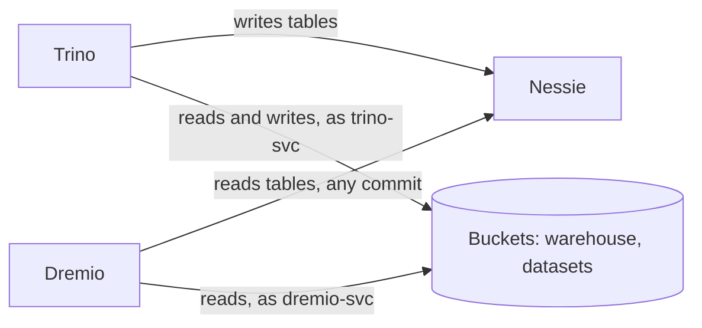

# Dremio on Buckets, on the lakehouse's Nessie catalog

This guide adds Dremio to the [lakehouse](lakehouse.md) (Buckets, Nessie, Trino, Apache Ranger, Keycloak):
- **Dremio queries the lakehouse's Iceberg tables** through the same Nessie catalog Trino uses: Trino writes a table, and Dremio reads it.
- **Dremio uses Nessie's history.** It reads a table as it was at any earlier commit (`AT COMMIT`), or on any branch.
- **Dremio queries raw files** (Parquet here) straight from a Buckets bucket.
- **Buckets enforces what Dremio may do.** Dremio's service account may only read, so Buckets refuses any write Dremio attempts, and the tables stay as Trino left them.

Everything runs from [`examples/dremio`](../../examples/dremio), which includes the lakehouse example's Compose file. A test script checks what this guide says the stack does, and CI runs it on each change to Buckets.

| Component | Version | Role |
|---|---|---|
| Dremio | 26.0.5, open-source edition (`dremio/dremio-oss`) | SQL over the lakehouse and raw files |
| Buckets, Nessie, Trino, Ranger, Keycloak | as in the [lakehouse](lakehouse.md) | Storage, catalog, governed SQL for people, identity |

## Identity and access: what the open-source edition does

Dremio's open-source edition has local accounts only. Sign-in with an OpenID Connect provider such as Keycloak, and per-user privileges on sources, tables and columns, are features of Dremio Enterprise ([Dremio: OpenID](https://docs.dremio.com/current/security/authentication/identity-providers/oidc/)). This example therefore splits the work:

| Concern | Where it's enforced here |
|---|---|
| What Dremio may read and write in storage | **Buckets.** Dremio's service account, `dremio-svc`, may read the `warehouse` and `datasets` buckets and write nothing. |
| What each person may see, down to masked columns and filtered rows | **Trino and Ranger,** with Keycloak sign-in, as in the lakehouse. |
| Who may use Dremio | Dremio's own local accounts. Everyone who can sign in to Dremio OSS can query every source it has. |

So in the open-source edition, give Dremio only what all of its users may see: curated datasets, or engineering teams' data. Keep personal data behind Trino and Ranger. With Dremio Enterprise, configure Keycloak as Dremio's OpenID provider, with the same realm and groups as the other examples, and map the groups to Dremio roles. This guide's test doesn't cover Enterprise.

## How it fits together



## Run it

You need Docker with Compose 2.24 or later, and about 8 GB of memory for Docker (Dremio alone takes up to 5 GB).

```bash
cd examples/dremio
docker compose up -d --wait        # the lakehouse, plus Dremio; about 40 seconds once pulled
docker compose run --rm test       # waits for Dremio's setup to finish first
```

```
ok   Dremio reads the lakehouse's Iceberg table through Nessie  (6 rows)
ok   Dremio and Trino agree on the table  (total 666.69 in Dremio, 666.69 in Trino)
ok   Dremio reads the table at an earlier Nessie commit  (0 rows at commit cdde89d4d7a8 (when it was created), 6 now)
ok   Dremio reads raw Parquet files in Buckets  (6 rows, 3 regions in datasets/sales/orders.parquet)
ok   Buckets refuses Dremio's writes (its account may only read)  (SYSTEM ERROR: AmazonS3Exception: Access Denied. (Service: Amazon S3; Status Code: 403; Error Code: AccessDenied; Request)
ok   the refused write leaves the table unchanged  (6 rows in Trino)
ok   analysts still get Ranger's masks and filters through Trino  (alice: 3 EU rows, cards XXXXXXXXXXXX1111)

all checks passed
```

Dremio's UI is at http://localhost:9047. Sign in as `admin` with `DREMIO_ADMIN_PASSWORD`. `docker compose down -v` stops everything and deletes the data. Run one example at a time: they use the same ports.

## How each piece is set up

`tools/dremio_setup.py` runs once, after the lakehouse's setup, and is safe to run again. It:
- **writes the data** through Trino, as bob: `iceberg.sales.orders` and `iceberg.sales.payroll`;
- **creates `dremio-svc`** in Buckets, and a Parquet file at `datasets/sales/orders.parquet`;
- **creates Dremio's first administrator** (`PUT /apiv2/bootstrap/firstuser`), and its two sources (`POST /api/v3/catalog`).

### Buckets

```json
{"Effect": "Allow", "Action": ["s3:GetBucketLocation", "s3:ListBucket"],
 "Resource": ["arn:aws:s3:::warehouse", "arn:aws:s3:::datasets"]},
{"Effect": "Allow", "Action": ["s3:GetObject"],
 "Resource": ["arn:aws:s3:::warehouse/*", "arn:aws:s3:::datasets/*"]}
```

This is the policy `dremio-read`, attached to `dremio-svc`. If Dremio should write Iceberg tables too, for example with CTAS or `INSERT`, add `s3:PutObject` and `s3:DeleteObject` on `warehouse`.

### Dremio's sources

The lakehouse, through Nessie (`type: NESSIE`):

```json
{"nessieEndpoint": "http://nessie:19120/api/v2", "nessieAuthType": "NONE",
 "awsRootPath": "warehouse", "credentialType": "ACCESS_KEY",
 "awsAccessKey": "dremio-svc", "awsAccessSecret": "...", "secure": false,
 "propertyList": [
   {"name": "fs.s3a.endpoint", "value": "buckets:9000"},
   {"name": "fs.s3a.path.style.access", "value": "true"},
   {"name": "fs.s3a.connection.ssl.enabled", "value": "false"},
   {"name": "dremio.s3.compat", "value": "true"}]}
```

The raw files, as an S3 source named `buckets` (`type: S3`). It has the same `propertyList`, plus:
- `"compatibilityMode": true`;
- `"whitelistedBuckets": ["datasets"]`;
- the metadata policy `"autoPromoteDatasets": true`, so a query on a file turns it into a table.

The source can't be named `files`, which is a reserved word in Dremio's SQL.

### Queries

```sql
SELECT * FROM lakehouse.sales.orders;                           -- the table, on Nessie's main branch
SELECT * FROM lakehouse.sales.orders AT COMMIT "<commit hash>"; -- as it was at that commit
SELECT * FROM lakehouse.sales.orders AT BRANCH main;
SELECT * FROM buckets.datasets.sales."orders.parquet";          -- a raw file in Buckets
```

Commit hashes are in Nessie's log: `GET /api/v2/trees/main/history`, or Nessie's UI at http://localhost:19120. Nessie records a commit for every change to a table.

## Going to production

Everything in the [lakehouse guide's list](lakehouse.md#going-to-production) applies. In addition:
- **Sign-in and privileges** need Dremio Enterprise; see [Identity and access](#identity-and-access-what-the-open-source-edition-does). In the open-source edition, change the administrator's password from the example's, create a local account for each user, and limit what the sources reach.
- **Dremio's distributed store** (`paths.dist`: reflections, uploads, job results) is a local volume here. In a cluster, it belongs on shared storage, such as a Buckets bucket with an account of its own.
- **TLS** for Dremio's UI and API, and `secure: true` with an `https://` endpoint for the sources once Buckets serves TLS.

## Troubleshooting

| Symptom | Cause |
|---|---|
| `Encountered "FROM files"` | `files` is a reserved word. Name the source something else, or quote it. |
| Dremio can't list or read the warehouse | Path-style requests and the endpoint come from `propertyList`: `fs.s3a.endpoint`, `fs.s3a.path.style.access` and `dremio.s3.compat`. Without them, the AWS client tries virtual-hosted requests to AWS. |
| Writes fail with `AccessDenied` (403) | Dremio's account may only read, by design here. Give it write access to the warehouse if it should write tables. |
| `AT COMMIT` finds no table | That commit is from before the table was created. Use a later commit in Nessie's history. |
| The test starts before Dremio is configured | `docker compose up --wait` doesn't wait for one-off setup services that nothing depends on. The test service depends on `dremio-setup`, so `docker compose run --rm test` waits for it. |
