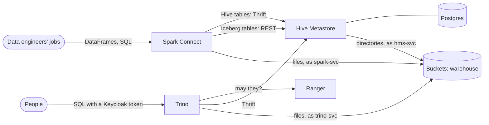

# Hive Metastore and Spark on Buckets, with Trino and Apache Ranger

This guide puts the classic data-lake stack on Buckets:
- **Hive Metastore** is the shared catalog, with Postgres behind it. It holds both classic Hive tables (Parquet files in partition directories) and Iceberg tables.
- **Apache Spark** writes and transforms the tables.
- **Trino** queries them with SQL, governed by **Apache Ranger**.
- **Keycloak** is the identity provider for Trino, Ranger and Buckets.

Spark and Trino work on the same tables through the one metastore. Spark writes and Trino reads; Trino writes and Spark reads.

Everything runs from one Compose file in [`examples/hive-spark`](../../examples/hive-spark), and a test script checks what this guide says the stack does. CI runs it on each change to Buckets. The sign-in and governance setup is the same as in the [lakehouse guide](lakehouse.md), which uses Nessie as the catalog instead.

| Component | Version | Role |
|---|---|---|
| Buckets | 1.4.2 | S3 storage for the warehouse; sign-in with Keycloak through STS |
| Hive Metastore | 4.2.1 (standalone), on Postgres 18 | The catalog for Hive and Iceberg tables; also serves an Iceberg REST catalog |
| Apache Spark | 4.1.3, with Iceberg 1.12.0 | Writes and transforms tables; runs as a Spark Connect server |
| Trino | 483 | SQL engine: Hive and Iceberg connectors |
| Apache Ranger | 2.9.0 | Access policies, column masks, row filters and audit for Trino |
| Keycloak | 26.8 | Users and groups, OpenID Connect tokens |

## How it fits together



| Catalog | In Spark | In Trino | Files in Buckets |
|---|---|---|---|
| Hive tables | `spark_catalog` (the default): `sales.orders` | `hive`: `hive.sales.orders` | `s3a://warehouse/hive/<db>.db/<table>/` |
| Iceberg tables | `iceberg`: `iceberg.analytics.daily_revenue` | `iceberg`: `iceberg.analytics.daily_revenue` | the same, with Iceberg's `data/` and `metadata/` |

**Who can read the warehouse.** Spark, Trino and the metastore each have a Buckets service account, and only those accounts can read the `warehouse` bucket. People query through Trino, where Ranger applies its masks and row filters. Ranger governs Trino, not Spark: Spark is an engine run by data engineers, with its own service account. So keep its endpoint for engineers and jobs only (see [Going to production](#going-to-production)).

## Run it

You need Docker with Compose v2, and about 6 GB of memory for Docker.

```bash
cd examples/hive-spark
docker compose up -d --wait        # about 40 seconds once the images are built and pulled
docker compose run --rm test
```

The first `up` builds the metastore and Spark images. That downloads Hadoop's S3A connector, the AWS SDK (about 600 MB) and Iceberg from Maven Central. On first use, Spark downloads its Hive 4.1 client from Maven Central too (see [Spark](#spark)), so the first test run takes about three minutes. Later runs are quicker.

```
ok   Spark writes a partitioned Hive table, and Trino reads it  (6 rows in partitions APAC, EU, US)
ok   Trino adds rows, and Spark reads them  (Spark sees 4 EU orders)
ok   Spark builds an Iceberg table, and Trino reads and changes it  (7 rows; revenue 730.79, then 905.74 after Trino's update)
ok   both engines read the table's first snapshot (time travel)  (Spark 730.79, Trino 730.79)
ok   the tables are files in Buckets  (7 files under hive/sales.db/orders/region=*, 4 Iceberg metadata files)
ok   Ranger's row filter: analysts see only EU orders  (4 rows, regions ['EU'])
ok   Ranger's column mask: analysts see only card numbers' last four digits  (XXXXXXXXXXXX1111)
ok   analysts read the Iceberg revenue table  (7 rows)
ok   analysts can't read other tables  (Access Denied: Cannot select from columns [employee, salary] in table or view payroll)
ok   analysts can't write  (Access Denied: Cannot insert into table orders)
ok   people in neither group are denied  (Access Denied: Cannot execute query)
ok   analysts use their own bucket, and can't read the warehouse's files  (scratch PutObject OK, warehouse GetObject AccessDenied)
ok   Ranger's audit log records the denials  (1 denied requests by carol)

all checks passed
```

`docker compose down -v` stops everything and deletes the data. Every password is in `.env`, and all of them are for local use only. Run one example at a time: this one and the lakehouse use the same ports.

Buckets' images are multi-arch from 1.4.2, so this runs as is on amd64 and arm64 (Apple silicon, AWS Graviton). To try Buckets built from your checkout, build it from the repository root and point the example at it:

```bash
docker build -f docker/Dockerfile.bucketsd -t buckets-local/bucketsd .
BUCKETS_IMAGE=buckets-local/bucketsd docker compose up -d --wait
```

### The people

| User | Keycloak group | In Trino | In Buckets |
|---|---|---|---|
| bob | `engineers` | Everything in the `hive` and `iceberg` catalogs | The `scratch` bucket |
| alice | `analysts` | `hive.sales.orders` (EU rows, card numbers masked) and `iceberg.analytics.daily_revenue` | The `scratch` bucket |
| carol | none | Nothing | Nothing |

## Look around

**Spark.** Use any Spark Connect client, such as `pyspark-client` 4.1, with Python 3.10 or later. The tools container has one:

```bash
docker compose run --rm -T test python - <<'EOF'
from pyspark.sql import SparkSession
spark = SparkSession.builder.remote("sc://spark:15002").getOrCreate()
spark.sql("SHOW TABLES IN sales").show()
spark.sql("SELECT region, count(*) FROM sales.orders GROUP BY region").show()
spark.sql("SELECT * FROM iceberg.analytics.daily_revenue.snapshots").show()
EOF
```

From your own machine, the server is at `sc://localhost:15002`.

**Trino.** As in the lakehouse guide: get a user's token, then use the CLI in the Trino container.

```bash
TOKEN=$(docker compose run --rm -T test python /common/get_token.py alice)
docker compose exec trino trino --server https://trino:8443 --insecure \
  --user alice --access-token "$TOKEN" --catalog hive --schema sales \
  --execute "SELECT id, customer, card_number, region FROM orders"
```

**Ranger.** Open http://localhost:6080 and sign in as `admin` with `RANGER_PASSWORD`. The policies are under **Trino → lakehouse**, and the audit trail is under **Audits → Access**.

**Buckets.** Use `mc ls -r` against `localhost:9000` (`admin`, `BUCKETS_ROOT_PASSWORD`) to see the tables' files under `warehouse/hive/`: partition directories like `sales.db/orders/region=EU/`, and Iceberg's `data/` and `metadata/`.

## How each piece is set up

`tools/setup.py` runs once at startup. It configures Buckets and Ranger using `examples/common/tools/lakekit.py`, and it's safe to run again.

### Buckets

| Policy | Allows | Attached to |
|---|---|---|
| `lakehouse-engine` | Read and write `warehouse` | `spark-svc`, `trino-svc`, `hms-svc` |
| `analysts`, `engineers` | Read and write `scratch` | Anyone whose Keycloak `groups` claim names them |

The metastore needs its own account because it creates and removes the directories of databases and tables. People sign in with OpenID Connect, as in the [lakehouse guide](lakehouse.md#buckets).

### Hive Metastore

The image is `apache/hive:standalone-metastore-4.2.1`, plus the Postgres driver and the AWS SDK. The image already has Hadoop's S3A connector (`hadoop-aws`), but not the SDK it calls. Its configuration is mounted from `hive/` through `HIVE_CUSTOM_CONF_DIR`.

`metastore-site.xml`:

```xml
<!-- tables' files: s3a://warehouse/hive/<db>.db/<table> -->
<property><name>metastore.warehouse.external.dir</name><value>s3a://warehouse/hive</value></property>
<property><name>hive.metastore.warehouse.external.dir</name><value>s3a://warehouse/hive</value></property>
<!-- managed (transactional) tables only; must not contain the directory above -->
<property><name>metastore.warehouse.dir</name><value>s3a://warehouse/managed</value></property>
<!-- the database -->
<property><name>javax.jdo.option.ConnectionURL</name><value>jdbc:postgresql://hms-db:5432/metastore</value></property>
<property><name>javax.jdo.option.ConnectionPassword</name><value>${env.HMS_DB_PASSWORD}</value></property>
<!-- the Iceberg REST catalog, http://hive-metastore:9001/iceberg -->
<property><name>metastore.catalog.servlet.port</name><value>9001</value></property>
```

Metastore 4 records plain, non-transactional tables as external tables with `external.table.purge=true`, even when they're created as managed tables. So Spark's and Trino's tables go to `metastore.warehouse.external.dir`. The external directory is listed under two names because the Iceberg REST catalog reads only the `hive.*` one. The managed directory has to be somewhere else, because the metastore refuses an external table inside the managed root.

`core-site.xml` points S3A at Buckets with path-style requests. The credentials come from the AWS environment variables (`software.amazon.awssdk.auth.credentials.EnvironmentVariableCredentialsProvider`), so no key is written in a file:

```xml
<property><name>fs.s3a.endpoint</name><value>http://buckets:9000</value></property>
<property><name>fs.s3a.endpoint.region</name><value>us-east-1</value></property>
<property><name>fs.s3a.path.style.access</name><value>true</value></property>
<property><name>fs.s3a.connection.ssl.enabled</name><value>false</value></property>
```

### Spark

Spark 4.1.3 runs as a **Spark Connect** server (`start-connect-server.sh`). Jobs and notebooks connect to it with a thin client: `sc://spark:15002`, or `spark-submit --remote`. Its image adds `hadoop-aws` 3.4.2, AWS SDK v2 2.29.52 (the version Hadoop 3.4.2 is built against) and Iceberg's Spark runtime. `spark/spark-defaults.conf` sets:

```properties
# Hive tables, through the metastore
spark.sql.catalogImplementation          hive
spark.hadoop.hive.metastore.uris         thrift://hive-metastore:9083
spark.sql.hive.metastore.version         4.1.0
spark.sql.hive.metastore.jars            maven
spark.sql.warehouse.dir                  s3a://warehouse/hive

# Buckets
spark.hadoop.fs.s3a.endpoint                 http://buckets:9000
spark.hadoop.fs.s3a.path.style.access        true
spark.hadoop.fs.s3a.aws.credentials.provider software.amazon.awssdk.auth.credentials.EnvironmentVariableCredentialsProvider

# Iceberg tables, through the metastore's Iceberg REST catalog
spark.sql.extensions                     org.apache.iceberg.spark.extensions.IcebergSparkSessionExtensions
spark.sql.catalog.iceberg                org.apache.iceberg.spark.SparkCatalog
spark.sql.catalog.iceberg.type           rest
spark.sql.catalog.iceberg.uri            http://hive-metastore:9001/iceberg
spark.sql.catalog.iceberg.io-impl        org.apache.iceberg.hadoop.HadoopFileIO
spark.sql.catalog.iceberg.cache-enabled  false
```

Three of these settings need explaining:
- **The Hive client.** Spark's built-in Hive client, 2.3, makes Thrift calls that Hive Metastore 4 no longer serves, such as `get_table`. So Spark loads a Hive 4.1 client from Maven Central on first use. It's kept on the `spark-ivy` volume. The driver's `user.home` is set to that volume (`SPARK_SUBMIT_OPTS=-Duser.home=/ivy`), because the client loader uses `user.home` rather than `spark.jars.ivy`. For offline clusters, put the Hive 4.1 jars in the image and use `spark.sql.hive.metastore.jars=path`.
- **Iceberg through REST.** Iceberg's Hive catalog inside Spark uses Spark's built-in Hive 2.3 classes, so it can't talk to metastore 4 over Thrift. The metastore's own REST catalog can, and it stores the tables exactly where Trino's `hive_metastore` Iceberg catalog finds them.
- **No catalog cache.** Other engines change these tables too. With caching on, Spark keeps reading the snapshot it saw first.

### Trino

Two catalogs on the same metastore, `trino/catalog/hive.properties` and `iceberg.properties`, each with Trino's own S3 client and service account:

```properties
connector.name=hive                      # iceberg.properties: connector.name=iceberg,
hive.metastore.uri=thrift://hive-metastore:9083   #   iceberg.catalog.type=hive_metastore
hive.non-managed-table-writes-enabled=true
fs.s3.enabled=true
s3.endpoint=http://buckets:9000
s3.region=us-east-1
s3.path-style-access=true
s3.aws-access-key=${ENV:TRINO_S3_ACCESS_KEY}
s3.aws-secret-key=${ENV:TRINO_S3_SECRET_KEY}
```

`hive.non-managed-table-writes-enabled` is there because metastore 4 records tables as external, and Trino otherwise refuses to write to them. Trino reads the `s3a://` locations that Spark and the metastore record. Sign-in (JWT with Keycloak) and the Ranger plugin are shared with the lakehouse example, in `examples/common/trino`; see [the lakehouse guide](lakehouse.md#trino).

### Ranger

The Trino service `lakehouse` has policies over both catalogs:

| Policy | Resource | Who | Allows |
|---|---|---|---|
| run queries, act as yourself | query ID `*`; Trino user `{USER}` | analysts, engineers; `{USER}` | `execute`; `impersonate` |
| hive catalog, iceberg catalog | `hive`, `iceberg` | engineers / analysts | all / `use`, `show` |
| engineers: schemas, tables | `hive.*`, `hive.*.*.*`, `iceberg.*`, `iceberg.*.*.*` | engineers | all |
| analysts: hive.sales.orders | `hive.sales`, `hive.sales.orders.*` | analysts | `use`, `show`; `select`, `show` |
| analysts: mask card numbers (masking) | `hive.sales.orders.card_number` | analysts | last four digits shown |
| analysts: EU orders only (row filter) | `hive.sales.orders` | analysts | `region = 'EU'` |
| analysts: iceberg.analytics.daily_revenue | `iceberg.analytics`, `iceberg.analytics.daily_revenue.*` | analysts | `use`, `show`; `select`, `show` |

## Going to production

Everything in the [lakehouse guide's list](lakehouse.md#going-to-production) applies: TLS everywhere, real secrets, Ranger usersync, and your own identity provider. In addition:
- **Protect Spark.** Spark Connect has no user sign-in here. Anyone who can reach port 15002 works with Spark's service account, and Ranger doesn't apply. Expose it only to engineers' jobs and notebooks, behind an authenticating proxy, or run jobs with `spark-submit` on Kubernetes under the service account.
- **Protect the metastore.** Ports 9083 (Thrift) and 9001 (REST) have no authentication here. Reach them only from the engines, or turn on the metastore's own authentication (Kerberos, or JWT with its HTTP transport) and `metastore.catalog.servlet.auth` for REST.
- **One account per engine.** The accounts can be narrowed further: for example, Spark write access to the prefixes its jobs own, and Trino read-only on what only Spark writes.
- **On Kubernetes,** run Buckets with its operator, and Spark with the Spark Operator or `spark-submit` against Kubernetes. The S3A and catalog settings above carry over unchanged.

## Troubleshooting

| Symptom | Cause |
|---|---|
| Spark: `Invalid method name: 'get_table'` | Spark's built-in Hive 2.3 client talking to Hive Metastore 4. Set `spark.sql.hive.metastore.version` to 4.x with `spark.sql.hive.metastore.jars`, as above. For Iceberg, use the metastore's REST catalog. |
| Spark: `/nonexistent/.ivy2.5.2/...` not found | The Hive client loader resolves jars into `user.home`, and the Spark image's user has none. Set `-Duser.home` on the driver. |
| Trino: `Cannot write to non-managed Hive table` | Metastore 4 recorded the table as external. Set `hive.non-managed-table-writes-enabled=true`. |
| Metastore: `Warehouse location is not set: hive.metastore.warehouse.external.dir=null` | The Iceberg REST catalog reads the `hive.*` name. Set it as well as `metastore.warehouse.external.dir`. |
| Metastore: `An external table's location should not be located within managed warehouse root directory` | `metastore.warehouse.dir` contains the external directory. Give managed tables a directory of their own. |
| Spark reads an old version of an Iceberg table that Trino changed | Spark's catalog cache. Set `spark.sql.catalog.iceberg.cache-enabled=false`, or run `REFRESH TABLE`. |
| S3A: `UnknownHostException: warehouse.buckets` | S3A defaulted to virtual-hosted requests. Set `fs.s3a.path.style.access=true`. |
| Metastore or Spark: `ClassNotFoundException` for `software.amazon.awssdk...` | `hadoop-aws` is on the classpath but the AWS SDK bundle isn't. Add the SDK version that Hadoop release is built against. |
| Ranger and Trino problems | See the [lakehouse guide's troubleshooting](lakehouse.md#troubleshooting). |
