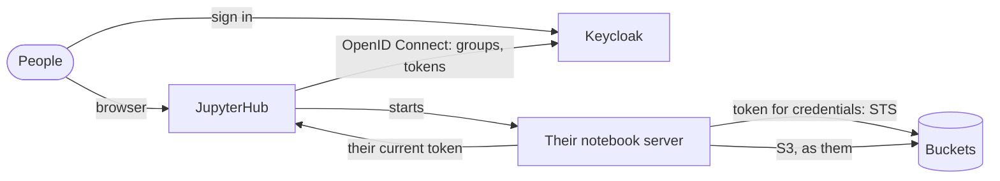

# JupyterHub on Buckets, with Keycloak sign-in and per-person storage

This guide gives a team JupyterHub with storage in Buckets, and one identity throughout:
- People sign in to **JupyterHub** with **Keycloak**. Their Keycloak groups decide whether they may sign in at all, and whether they administer the hub.
- Each person gets a notebook server in a container of their own.
- Notebooks reach Buckets **as the person who signed in**, with temporary credentials exchanged from their Keycloak token. There are no shared keys, and no keys in notebooks at all.
- Each person has a private prefix, `home/<username>/`. Their groups decide what they may do with the team's shared `datasets` bucket.

Everything runs from one Compose file in [`examples/jupyterhub`](../../examples/jupyterhub), and a test script checks what this guide says the stack does. The test signs people in through Keycloak's login form and runs code in their notebooks. CI runs it on each change to Buckets. The Keycloak realm is the one the [lakehouse](lakehouse.md) and [Hive Metastore and Spark](hive-spark.md) examples use.

| Component | Version | Role |
|---|---|---|
| Buckets | 1.5.0 | Storage; temporary credentials from a Keycloak token (STS) |
| JupyterHub | 6.0.1 | Sign-in, one notebook server per person |
| OAuthenticator | 17.4.0 | JupyterHub's Keycloak (OpenID Connect) sign-in |
| DockerSpawner | 14.0.0 | Starts each person's notebook server in its own container |
| JupyterLab | 4.6 (`quay.io/jupyter/base-notebook:hub-6.0.1`) | The notebook server, with boto3, pandas and `buckets_lake` |
| Keycloak | 26.8 | Users and groups, OpenID Connect tokens |

## How it fits together



1. **Sign-in.** JupyterHub sends people to Keycloak (the authorization code flow), and gets back their username (`preferred_username`) and their `groups`.
2. **Groups.** The hub lets in members of `analysts` or `engineers` (`allowed_groups`), and makes `engineers` hub admins (`admin_groups`). It mirrors the groups as JupyterHub groups on every sign-in, and refuses anyone else.
3. **Tokens.** The hub keeps each person's Keycloak tokens in its database, encrypted (`auth_state`), and refreshes them with Keycloak's refresh token.
4. **A notebook server per person.** DockerSpawner starts it in a container of its own, with an API token for that server alone.
5. **Buckets credentials.** In the notebook, `buckets_lake` asks the hub for the person's current access token, using the server's API token. It exchanges the access token with Buckets' STS (`AssumeRoleWithWebIdentity`) for temporary credentials, and renews them before they expire.
6. **Policies.** Buckets maps the token's `groups` to policies of the same names, and fills `${jwt:preferred_username}` in them with the person's name. That makes one policy cover everyone's private prefix.

Nobody's notebook holds a key that outlives their session. A change to someone's Keycloak groups reaches the hub at their next sign-in or token refresh, and reaches Buckets with their next credentials, which last an hour.

| | `analysts` (alice) | `engineers` (bob) | Neither (carol) |
|---|---|---|---|
| Sign in to JupyterHub | Yes | Yes, as a hub admin | No (HTTP 403) |
| `home/<their name>/` | Read and write | Read and write | n/a |
| Anyone else's `home/` prefix | No | No | n/a |
| `datasets` | Read | Read and write | n/a |

## Run it

You need Docker with Compose v2, and about 2 GB of memory for Docker.

```bash
cd examples/jupyterhub
docker compose up -d --wait        # builds the hub and notebook images on first run
docker compose run --rm test
```

JupyterHub starts notebook containers through the Docker socket. With rootless Docker, for example with Lima, set its path first: `DOCKER_SOCK=/run/user/$(id -u)/docker.sock` (in `.env`, or in the shell).

```
ok   people sign in to JupyterHub with Keycloak, and their groups come along  (alice ['analysts'], bob ['engineers'])
ok   Keycloak's engineers group administers the hub, and analysts don't  (bob admin=True, alice admin=False)
ok   people in neither group can't sign in  (HTTP 403)
ok   each notebook gets its own person's Keycloak token  (alice's notebook: alice ['analysts']; bob's: bob ['engineers'])
ok   notebooks hold no keys  (credential variables: none)
ok   each person reads and writes their own home prefix  (alice OK, bob OK)
ok   nobody reads or writes another person's prefix  (alice on bob's: GetObject AccessDenied, ListObjects AccessDenied, PutObject AccessDenied)
ok   analysts and engineers read the shared datasets  (6 orders read with pandas)
ok   only engineers write the shared datasets  (alice AccessDenied, bob OK)
ok   the notebooks' files are in Buckets, each under its person's prefix  (alice/notes.txt, bob/notes.txt)

all checks passed
```

`docker compose down -v` stops everything and deletes the data. The notebook containers and their `jupyterhub-user-<name>` volumes are created by JupyterHub, not Compose, so remove them with `docker rm -f jupyter-alice jupyter-bob` and `docker volume rm jupyterhub-user-alice jupyterhub-user-bob`. Every password is in `.env`, and all of them are for local use only. Run one example at a time: they use the same ports.

**In a browser.** Tokens and redirects use the names `keycloak` and `jupyterhub`, as the containers see each other. Add them to your machine's hosts file:

```bash
echo "127.0.0.1 keycloak jupyterhub" | sudo tee -a /etc/hosts
```

Then open http://jupyterhub:8000 and sign in as `alice` or `bob`, with `LAKEHOUSE_USER_PASSWORD` from `.env`.

## Use it in a notebook

```python
import io
import pandas as pd
import buckets_lake

s3 = buckets_lake.s3()                       # boto3, as you
me = buckets_lake.username()

s3.put_object(Bucket="home", Key=f"{me}/notes.txt", Body=b"my notes")
orders = pd.read_parquet(io.BytesIO(
    s3.get_object(Bucket="datasets", Key="sales/orders.parquet")["Body"].read()))
```

`buckets_lake.session()` gives a boto3 session for other AWS SDK clients, and `buckets_lake.token()` gives the person's current Keycloak token, for other services that accept it.

## How each piece is set up

### Keycloak

The realm (`examples/common/keycloak/lakehouse-realm.json`) has a confidential client, `jupyterhub`:
- the redirect URI `http://jupyterhub:8000/hub/oauth_callback`, and the standard (authorization code) flow only;
- a **groups** mapper: group names, without the leading `/`, in the `groups` claim of the ID token, the access token and userinfo;
- an **audience** mapper that adds `lakehouse` to the access token's `aud`. Buckets accepts a token only if its `aud` (or `azp`) is the client ID it's configured with, `lakehouse`. Without the mapper, the token's `azp` is `jupyterhub` and STS refuses it.

The client secret comes from `JUPYTERHUB_OAUTH_SECRET`.

### JupyterHub

`jupyterhub/jupyterhub_config.py`:

```python
c.JupyterHub.authenticator_class = "generic-oauth"
c.GenericOAuthenticator.client_id = "jupyterhub"
c.GenericOAuthenticator.oauth_callback_url = "http://jupyterhub:8000/hub/oauth_callback"
c.GenericOAuthenticator.authorize_url = f"{KEYCLOAK}/auth"      # KEYCLOAK = .../realms/lakehouse/protocol/openid-connect
c.GenericOAuthenticator.token_url = f"{KEYCLOAK}/token"
c.GenericOAuthenticator.userdata_url = f"{KEYCLOAK}/userinfo"
c.GenericOAuthenticator.username_claim = "preferred_username"

c.GenericOAuthenticator.manage_groups = True
c.GenericOAuthenticator.auth_state_groups_key = "oauth_user.groups"
c.GenericOAuthenticator.allowed_groups = {"analysts", "engineers"}
c.GenericOAuthenticator.admin_groups = {"engineers"}

c.GenericOAuthenticator.enable_auth_state = True    # needs JUPYTERHUB_CRYPT_KEY
c.GenericOAuthenticator.refresh_pre_spawn = True
c.GenericOAuthenticator.auth_refresh_age = 120

c.JupyterHub.load_roles = [
    {"name": "user", "scopes": ["self", "admin:auth_state!user"]},
    {"name": "server",
     "scopes": ["users:activity!user", "access:servers!server", "read:users:name!user", "admin:auth_state!user"]},
]
```

The two roles let a notebook server read its own person's tokens, and nobody else's:
- **The server role** gives each server's API token `admin:auth_state!user`, which filters to that server's owner.
- **The user role** needs the same scope. A token only gets scopes its owner holds, and ordinary users don't hold `admin:auth_state`, even for themselves. Without it, admins' notebooks work and everyone else's get no token.

DockerSpawner starts `buckets-jupyterhub-notebook` on the Compose network, so notebooks reach `buckets:9000`. Each person's `/home/jovyan/work` is on a volume of their own. The hub needs the Docker socket to start containers.

### Buckets

```yaml
MINIO_IDENTITY_OPENID_CONFIG_URL: http://keycloak:8080/realms/lakehouse/.well-known/openid-configuration
MINIO_IDENTITY_OPENID_CLIENT_ID: lakehouse
MINIO_IDENTITY_OPENID_CLAIM_NAME: groups
```

`tools/setup.py` creates the buckets `home` and `datasets`, and two policies named after the groups. Both give everyone their own prefix with one statement, through a policy variable:

```json
{"Effect": "Allow", "Action": ["s3:ListBucket"], "Resource": ["arn:aws:s3:::home"],
 "Condition": {"StringLike": {"s3:prefix": ["${jwt:preferred_username}/*", "${jwt:preferred_username}"]}}},
{"Effect": "Allow", "Action": ["s3:GetObject", "s3:PutObject", "s3:DeleteObject"],
 "Resource": ["arn:aws:s3:::home/${jwt:preferred_username}/*"]}
```

`analysts` adds read access to `datasets`, and `engineers` read and write. There are no service accounts: nothing here reaches Buckets except as a person.

### The notebook image

`images/Dockerfile` builds it from `quay.io/jupyter/base-notebook:hub-6.0.1`, adding boto3, pandas, pyarrow and `buckets_lake` (`images/buckets_lake.py`). The helper reads the person's tokens from `/hub/api/users/<name>`, not `/hub/api/user`, because the hub fills in `auth_state` only on the former. Its boto3 credentials are refreshable: they are fetched again through the hub and STS when they near expiry.

## Going to production

- **On Kubernetes,** use [Zero to JupyterHub](https://z2jh.jupyter.org) (KubeSpawner) with the same authenticator and role settings in `hub.config`, and the Buckets operator for storage. Buckets' endpoint becomes its in-cluster Service.
- **TLS everywhere,** for Keycloak, JupyterHub and Buckets. The redirect URI and the endpoints change to `https://`.
- **The Docker socket** gives the hub control of the host's Docker. KubeSpawner avoids it.
- **Secrets:** keep `JUPYTERHUB_CRYPT_KEY` and the client secret in a secret store, not in `.env`. Losing the crypt key only means everyone signs in again.
- **Tokens in notebooks.** A person's notebook can read their own Keycloak tokens, refresh token included. They're the person's own, and they're no use to anyone without that person's session. Shorten Keycloak's token lifetimes to match your sessions.
- **More services, one identity.** The access token carries the `lakehouse` audience, which Trino in the [lakehouse example](lakehouse.md) also checks. So a notebook can query Trino as the person, under Ranger's policies, with `buckets_lake.token()`. That combination isn't part of this example's test.
- **Long sessions.** The hub refreshes a person's tokens with Keycloak's refresh token (`auth_refresh_age`), until Keycloak's session for them ends. The test doesn't wait out a token's lifetime.

## Troubleshooting

| Symptom | Cause |
|---|---|
| Sign-in ends in HTTP 403 | The person is in none of `allowed_groups`, or the `groups` claim is missing from userinfo. Check the client's groups mapper. |
| Admins' notebooks get a token, others' don't | The user role lacks `admin:auth_state!user`. A server token only gets scopes its owner holds. |
| `auth_state` is `null` | It was read from `/hub/api/user`. Use `/hub/api/users/<name>`. Or `enable_auth_state` is off, or `JUPYTERHUB_CRYPT_KEY` isn't set. |
| STS: "`azp` must match configured OpenID Client ID" | The token's audience doesn't name Buckets' client ID. Add an audience mapper for it to the `jupyterhub` client. |
| A notebook can't reach `buckets:9000` | `DockerSpawner.network_name` isn't the Compose network. Here it's pinned as `buckets-jupyterhub`. |
| The hub can't start notebooks: permission denied on `docker.sock` | With rootless Docker, the socket is `/run/user/<uid>/docker.sock`. Set `DOCKER_SOCK`. |
| The browser can't load `keycloak:8080` | Add `127.0.0.1 keycloak jupyterhub` to the hosts file. |
| Scripted sign-ins: `multiple cookies with name '_xsrf'` | A running notebook server sets its own `_xsrf` cookie under `/user/<name>/`. Send the hub's, from `/hub/`. |
