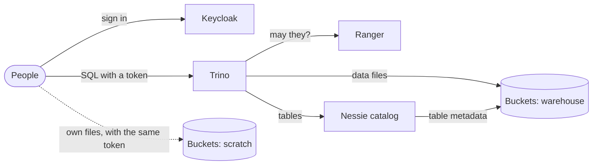

# Lakehouse: Iceberg on Buckets with Nessie, Trino and Apache Ranger

This guide builds a small data platform on Buckets:
- **Buckets** stores the tables, as Apache Iceberg files.
- **Project Nessie** is the catalog.
- **Trino** queries the tables with SQL.
- **Apache Ranger** decides who may query what, down to rows and columns.
- **Keycloak** is the identity provider for all of them, so a person's groups mean the same thing in Trino, Ranger and Buckets.

Everything runs from one Compose file in [`examples/lakehouse`](../../examples/lakehouse), and a test script checks what this guide says the stack does. CI runs it on each change to Buckets. For notebooks, see [jupyterhub.md](jupyterhub.md); for dashboards, [superset.md](superset.md); for Dremio, [dremio.md](dremio.md); for pipelines, [airflow.md](airflow.md). For Hive Metastore and Spark, see [hive-spark.md](hive-spark.md).

| Component | Version | Role |
|---|---|---|
| Buckets | 1.11.1 | S3 storage for the warehouse; sign-in with Keycloak through STS |
| Nessie | 0.108.8 | Iceberg REST catalog, with a git-like commit history |
| Trino | 483 | SQL engine, Iceberg connector |
| Apache Ranger | 2.9.0 | Access policies, column masks, row filters and audit for Trino |
| Keycloak | 26.8 | Users and groups, OpenID Connect tokens |

## How it fits together



There are two layers of access control, and the setup only works if they agree:

| Layer | Controls | Enforced by |
|---|---|---|
| Ranger, through Trino | Who can query which catalogs, schemas, tables and columns, with row filters, column masks and an audit trail | Trino's Ranger access control |
| Buckets IAM | Who can touch the warehouse's files at all | Buckets policies and STS |

**Only the engines can read the warehouse.** Trino and Nessie each have a Buckets service account whose policy covers the `warehouse` bucket and nothing else. People get no access to it, and query through Trino. If an analyst also had S3 keys for the warehouse, they could read the Parquet files directly, around every mask and row filter in Ranger. People still sign in to Buckets with their Keycloak token for their own files, in the `scratch` bucket.

## Run it

You need Docker with Compose 2.24 or later, and about 8 GB of memory for Docker.

```bash
cd examples/lakehouse
docker compose up -d --wait        # about 30 seconds once the images are pulled
docker compose run --rm test
```

The checks:

```
ok   engineers create, load and change an Iceberg table  (7 rows, order 1 now 130.50)
ok   Nessie records every change as a commit  (4 commits for sales.orders on branch main)
ok   the table's data and metadata are in Buckets  (4 Parquet files, 4 metadata files under s3://warehouse/sales/)
ok   Ranger's row filter: analysts see only EU orders  (4 rows, regions ['EU'])
ok   Ranger's column mask: analysts see only card numbers' last four digits  (XXXXXXXXXXXX1111)
ok   analysts can't read other tables  (Access Denied: Cannot select from columns [employee, salary] in table or view payroll)
ok   analysts can't create tables  (Access Denied: Cannot create table notes)
ok   analysts can't write to sales.orders  (Access Denied: Cannot insert into table orders)
ok   people in neither group are denied  (Access Denied: Cannot execute query)
ok   analysts sign in to Buckets with their Keycloak token and use their own bucket  (OK)
ok   analysts can't read the warehouse's files directly  (GetObject AccessDenied, ListObjects AccessDenied)
ok   Ranger's audit log records the denials  (1 denied requests by carol)

all checks passed
```

`docker compose down -v` stops everything and deletes the data. Every password is in `.env`, and all of them are for local use only.

Buckets' images are multi-arch from 1.4.2, so this runs as is on amd64 and arm64 (Apple silicon, AWS Graviton). To try Buckets built from your checkout, build it from the repository root and point the example at it:

```bash
docker build -f docker/Dockerfile.bucketsd -t buckets-local/bucketsd .
BUCKETS_IMAGE=buckets-local/bucketsd docker compose up -d --wait
```

### The people

| User | Keycloak group | In Trino | In Buckets |
|---|---|---|---|
| bob | `engineers` | Everything in the `iceberg` catalog | The `scratch` bucket |
| alice | `analysts` | `sales.orders` only: EU rows, card numbers masked | The `scratch` bucket |
| carol | none | Nothing | Nothing |

All three have the password `LAKEHOUSE_USER_PASSWORD` from `.env`.

## Look around

**Query as someone.** Get their token from Keycloak, then use the Trino CLI in the Trino container:

```bash
TOKEN=$(docker compose run --rm -T test python /common/get_token.py alice)
docker compose exec trino trino --server https://trino:8443 --insecure \
  --user alice --access-token "$TOKEN" --catalog iceberg --schema sales \
  --execute "SELECT id, customer, card_number, region FROM orders"
```

`--user` must match the token: Ranger lets people act only as themselves. `--insecure` skips checking Trino's self-signed certificate.

**Ranger.** Open http://localhost:6080 and sign in as `admin` with `RANGER_PASSWORD`.
- Under **Trino → lakehouse** are the example's policies: access, masking and row-level filter.
- **Audits → Access** lists every allowed and denied request.
- Change a policy, and Trino applies it within five seconds.

**Buckets.** With `mc`:

```bash
mc alias set lakehouse http://localhost:9000 admin lakehouse-admin-1
mc tree lakehouse/warehouse
mc ls -r lakehouse/warehouse/sales/
```

**Nessie.** http://localhost:19120 shows the catalog's branches and commits.

## How each piece is set up

`tools/setup.py` runs once at startup and configures Buckets and Ranger. It's safe to run again.

### Buckets

Two buckets: `warehouse` for the tables, and `scratch` for people's own files. Policies:

| Policy | Allows | Attached to |
|---|---|---|
| `lakehouse-engine` | Read and write `warehouse` | Service accounts `trino-svc` and `nessie-svc` |
| `analysts`, `engineers` | Read and write `scratch` | Anyone whose Keycloak `groups` claim names them |

The service accounts are ordinary users (`mc admin user add`, then `mc admin policy attach`). People sign in through OpenID Connect:

```yaml
MINIO_IDENTITY_OPENID_CONFIG_URL: http://keycloak:8080/realms/lakehouse/.well-known/openid-configuration
MINIO_IDENTITY_OPENID_CLIENT_ID: lakehouse
MINIO_IDENTITY_OPENID_CLAIM_NAME: groups
```

Each value in the token's `groups` claim names a Buckets policy, and values with no matching policy are ignored. So carol, who has no groups, gets nothing. The token's `aud` (or `azp`) must be the client ID. [identity.md](../identity.md) covers the same setup with Microsoft Entra ID.

### Nessie

Nessie serves the Iceberg REST API at `http://nessie:19120/iceberg/`. It writes table metadata to the warehouse with its own service account:

```properties
nessie.catalog.default-warehouse=warehouse
nessie.catalog.warehouses.warehouse.location=s3://warehouse/
nessie.catalog.service.s3.default-options.endpoint=http://buckets:9000/
nessie.catalog.service.s3.default-options.region=us-east-1
nessie.catalog.service.s3.default-options.path-style-access=true
nessie.catalog.service.s3.default-options.access-key=urn:nessie-secret:quarkus:nessie.catalog.secrets.access-key
nessie.catalog.secrets.access-key.name=nessie-svc
nessie.catalog.secrets.access-key.secret=...
```

These are the settings Nessie's own examples use for MinIO, with Buckets' address in place of MinIO's.

Nessie keeps history differently from other Iceberg catalogs:
- **History is in Nessie's commits.** Each change to a table is a commit on a branch, like git, and table metadata keeps only the current Iceberg snapshot. So Trino's `FOR VERSION AS OF` finds no earlier snapshots; you read earlier states through Nessie's branches and commits instead.
- **Dropping a table deletes no files.** Tables carry `gc.enabled=false`, so files stay in the warehouse until Nessie's garbage collector removes those no commit refers to.

### Trino

The Iceberg catalog, `trino/catalog/iceberg.properties`, uses Trino's own S3 client and service account:

```properties
connector.name=iceberg
iceberg.catalog.type=rest
iceberg.rest-catalog.uri=http://nessie:19120/iceberg/
iceberg.rest-catalog.warehouse=warehouse
fs.s3.enabled=true
s3.endpoint=http://buckets:9000
s3.region=us-east-1
s3.path-style-access=true
s3.aws-access-key=${ENV:TRINO_S3_ACCESS_KEY}
s3.aws-secret-key=${ENV:TRINO_S3_SECRET_KEY}
```

**Sign-in.** People present a Keycloak access token (`http-server.authentication.type=JWT`). Trino checks it against Keycloak's keys, issuer and audience, and takes the user name from `preferred_username`. Trino accepts tokens only over HTTPS, so the example gives Trino a self-signed certificate.

**Authorization.** `access-control.properties` hands every decision to Ranger:

```properties
access-control.name=ranger
ranger.service.name=lakehouse
ranger.plugin.config.resource=/etc/trino/ranger-trino-security.xml,/etc/trino/ranger-trino-audit.xml
```

`ranger-trino-security.xml` (in `examples/common/trino`, with Trino's other shared settings) points the plugin at Ranger and polls for policy changes every five seconds. It sets `use.rangerGroups`, so a user's groups come from Ranger. Trino has no way to read groups from a token. `ranger-trino-audit.xml` sends audits to Ranger's Solr.

### Ranger

`setup.py` creates:
- **Users and groups**, copied from Keycloak. In a real deployment, Ranger's usersync does this from LDAP or Entra ID.
- **A plugin user, `trino-plugin`.** Ranger 2.9 lets plugins download policies only when they sign in. The Trino service's `policy.download.auth.users`, `tag.download.auth.users` and `userstore.download.auth.users` name this user, so only Trino's plugin can read the policies.
- **The Trino service `lakehouse`** and its policies:

| Policy | Resource | Who | Allows |
|---|---|---|---|
| run queries | query ID `*` | analysts, engineers | `execute` |
| act as yourself | Trino user `{USER}` | `{USER}` | `impersonate` |
| iceberg catalog | catalog `iceberg` | engineers / analysts | all / `use`, `show` |
| engineers: iceberg schemas, tables | `iceberg.*`, `iceberg.*.*.*` | engineers | all |
| analysts: sales schema | `iceberg.sales` | analysts | `use`, `show` |
| analysts: sales.orders | `iceberg.sales.orders.*` | analysts | `select`, `show` |
| analysts: mask card numbers (masking) | `iceberg.sales.orders.card_number` | analysts | last four digits shown |
| analysts: EU orders only (row filter) | `iceberg.sales.orders` | analysts | `region = 'EU'` |

Ranger allows one access policy per resource, so where engineers and analysts share a resource, as with the `iceberg` catalog, the policy has an item for each group.

### Keycloak

The realm `lakehouse` (`examples/common/keycloak/lakehouse-realm.json`) has the three users, two groups, and one client, `lakehouse`, with two token mappers:
- **groups:** the user's group names, without the leading `/` (`full.path` off), in the `groups` claim;
- **audience:** `lakehouse` in the access token's `aud`, which Trino and Buckets both check.

The issuer is pinned with `KC_HOSTNAME=http://keycloak:8080`, so tokens carry the same issuer whoever asks for them. Trino and Buckets reject tokens from any other issuer.

## Going to production

The example takes shortcuts that a real deployment shouldn't:
- **TLS everywhere.** Buckets (`--certs-dir`), Keycloak, Ranger and Nessie all run over plain HTTP here.
- **Nessie needs sign-in.** Here anyone who can reach Nessie can change the catalog, though not read the data. Turn on its OpenID Connect authentication with the same identity provider.
- **Real secrets.** Keep passwords and keys in Kubernetes Secrets or Vault, not in `.env`.
- **Ranger usersync.** Sync users and groups from your directory, and keep Ranger's groups and Buckets' policy names the same.
- **Identity provider.** Entra ID works as well as Keycloak. In Entra, group claims carry IDs rather than names, so use app roles; see [identity.md](../identity.md).
- **On Kubernetes,** run Buckets with its operator ([README](../../README.md#on-kubernetes)), and Trino, Ranger and Nessie with their own Helm charts. The configuration above carries over unchanged.

## Troubleshooting

| Symptom | Cause |
|---|---|
| Ranger rejects the admin password until a few minutes have passed | Five failed sign-ins within five minutes lock a Ranger account. The Ranger image's own bootstrap script signs in with the image's default password, so the examples replace that script (`examples/common/ranger/create-ranger-services.py`) and checks Ranger's health without signing in. |
| Trino logs `Unauthenticated access not allowed` from Ranger | The plugin isn't signing in. Set `ranger.plugin.trino.policy.rest.client.username` and `.password`. |
| Ranger: `Another policy already exists for matching resource` | Merge the policy items into the existing policy for that resource. |
| Trino: `Principal alice cannot become user trino` | The CLI sends your OS user name. Pass `--user` with the token's user. |
| Trino or Buckets rejects a valid token | The token's issuer differs, for example `http://localhost:8080` rather than `http://keycloak:8080`. Get tokens from inside the Compose network, or set `KC_HOSTNAME`. |
| `FOR VERSION AS OF`: snapshot does not exist | Nessie keeps history as catalog commits, not Iceberg snapshots. See [Nessie](#nessie). |
