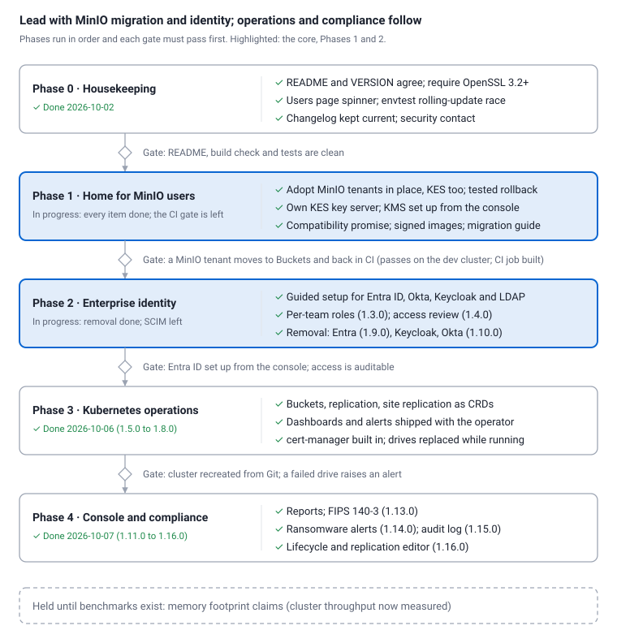

# Buckets Roadmap

As of 2026-10-04 · Russell Myers

## Summary

Buckets should become the maintained home for MinIO users, then win on enterprise identity and Kubernetes operations. Matching MinIO is done: Buckets is a C rewrite of MinIO's last public release and implements 220 of its 222 API handlers. MinIO's community project was archived in April 2026, so its users now need a supported successor more than another feature.

The order below leads with what builds on work that already exists (MinIO on-disk compatibility, the operator, Entra ID sign-in) and needs no storage-engine changes. Performance claims wait until benchmarks back them.

A successor can't depend on what it replaces. MinIO no longer publishes its images or binaries, so Buckets now ships its own key server (`buckets-kes`) in place of MinIO's KES, and keeps mirrors of MinIO's last images only for adoption and rollback.

**Where things stand (2026-10-04):** Phase 0 is done, and so is every item of Phase 1: adoption (KES included), rollback, encryption, signed release artifacts, the migration guide and the compatibility promise. Buckets 1.0.0, 1.1.0 and 1.1.1 are released, and the main repository is https://github.com/StorScale/buckets.

- **Left in Phase 1:** its gate, the round trip in CI. The job (`adopt-roundtrip`) is built and waits for access to the cluster it runs on.
- **In Phase 2:** guided sign-in setup in the console is done (1.2.0): Entra ID, Okta, Keycloak, other OpenID providers, and LDAP. So are per-team roles (1.3.0). Next are SCIM and an access review page.

## Priorities at a glance

Phases 1 and 2 carry the case for choosing Buckets; Phases 3 and 4 make it easier to adopt and to sell to regulated teams. No dates are set yet: each phase starts when the gate before it passes.

## Phase 0: Housekeeping (done)

Small fixes that decide whether people trust Buckets as the maintained successor. Each is days of work, not weeks.

- [x] Update the README: it said "Status: 0.3.0" and "Next up is the Kubernetes operator", but `VERSION` is 0.10.0 and the operator ships. Done 2026-10-02.
- [x] Require OpenSSL 3.2 or later at configure time. The build accepts 3.0, then fails compiling Argon2 code.
- [x] Fix the brief loading spinner on the Users page when local users are hidden.
- [x] Fix the envtest rolling-update step, which fails on a race with or without recent changes ("pod not found").
- [x] Keep CHANGELOG.md current with each release, and publish a security contact so users can report issues.

## Phase 1: The maintained home for MinIO users (in progress)

The goal is a safe, supported move from an archived MinIO deployment to Buckets. Buckets already reads and writes MinIO's exact on-disk format, so this is packaging and tooling, not storage work.

- [x] **Adopt existing MinIO tenants.** The operator takes over a MinIO Operator tenant's volumes in place, with no data copy.
  - `scripts/adopt-minio.sh` plans by default, and with `--apply` saves the tenant, keeps its PVs and creates the `BucketsCluster`.
  - The operator gained the tenant's layout: `configuration` (config.env), `drives`, `securityContext`, `servicePort`, and extra volumes.
- [x] **A tested rollback.** `scripts/rollback-to-minio.sh` hands the drives back.
  - `tests/e2e-k8s/adopt-minio.sh` passes 29/29 on the shared cluster, from MinIO `RELEASE.2024-10-13` to Buckets and back with nothing lost.
  - MinIO older than `RELEASE.2024-10-29` can't read xl.meta metaVersion 3. For those, adoption sets `BUCKETS_XL_META_VERSION=2`, checked in `tests/integration/minio-rollback.sh`.
- [x] **Encryption without MinIO's components.**
  - `buckets-kes` is Buckets' own KES-compatible key server. It keeps keys exactly as MinIO KES does, so keys from an adopted deployment stay readable. It works with HashiCorp Vault, AWS Secrets Manager, Azure Key Vault and Google Secret Manager.
  - The console's Encryption page sets it up: choose the key store, test the connection with a temporary key server, then apply.
  - Keys can be created and deleted safely.
  - Objects stored unencrypted can be encrypted in place. See `docs/encryption.md`.
- [x] **Carry over a tenant's KES.** `scripts/adopt-minio.sh` maps the tenant's running KES configuration onto Secret `<tenant>-kms` and `spec.kms.kes` (`createKey: false`, the tenant's KES account and scheduling). `buckets-kes check` reads the default key before MinIO stops, and the servers wait for KES. `KES=1 tests/e2e-k8s/adopt-minio.sh` passes 44/44 on the shared cluster: MinIO's own KES on Vault, adopted by buckets-kes and rolled back, with MinIO decrypting what Buckets encrypted.
- [x] **A compatibility promise.** [docs/compatibility.md](compatibility.md) states what every 1.x release keeps compatible, across releases and with MinIO: the on-disk format (and handing drives back to older MinIO), the S3, admin and STS APIs, `mc` and the SDKs, events, audit and trace, metrics, configuration, KES, the CRDs and rolling upgrades. Each promise names the test that proves it, and the page lists what is not promised (mixed MinIO and Buckets clusters, among others).
- [x] **Release artifacts.** Since 1.1.0, each release tag publishes the four images to `ghcr.io/storscale`, signed with cosign (keyless, as the release workflow) and carrying an SBOM and build provenance. It also publishes the operator's Helm chart to `oci://ghcr.io/storscale/charts/buckets-operator`, signed the same way. All of these are public.
- [x] **A migration guide.** [docs/migration.md](migration.md) covers:
  - mirroring MinIO's images first, since they're gone upstream;
  - identity (MinIO config to Entra ID or Okta), TLS and monitoring;
  - KES.

Done when: a MinIO tenant with real data moves to Buckets and back again in CI, with no data loss. The round trip passes on the shared cluster (29/29, and 44/44 with KES). The CI job runs it on release tags and by hand on `main`, plain and with KES, once the pipeline can reach the cluster (`KUBE_CONTEXT` through the GitLab agent, or a `KUBECONFIG` variable).

## Phase 2: Enterprise identity

Identity-provider sign-in with role-based access should be a feature people choose Buckets for, not a set of environment variables. Entra ID sign-in with app roles works today; this phase makes it easy to set up and to audit.

- [x] **Guided setup in the console** for Entra ID, Okta and Keycloak, replacing hand-written `MINIO_IDENTITY_OPENID_*` settings, with LDAP and Active Directory as well (Identity → Sign-in; see [identity.md](identity.md)). Each provider's steps are shown with the redirect URI to copy; a test sign-in (or LDAP lookup) checks the settings as the servers will before anything changes; the operator applies them to the servers (OpenID at once, LDAP with a rolling restart) and the console. `tests/e2e-k8s/identity.sh` passes on the shared cluster against a real Keycloak and OpenLDAP.
- [x] **Per-bucket and per-team roles** (1.3.0; Identity → Teams, see [identity.md](identity.md#teams) and [the design](design/teams.md)). A team is a name and its buckets, named or by prefix; each level becomes a `team-<name>-ro`, `-rw` or `-admin` policy, with the matching step for each identity provider. Teams are stored only as those policies, so they survive the MinIO round trip, which `tests/e2e-k8s/adopt-minio.sh` checks.
- **Automatic provisioning and removal (SCIM).** People who leave lose access and their access keys without manual cleanup.
- **An access review page.** Answer "who can read this bucket, and why", and test whether a given user would be allowed an action.
- **Local-users policy.** Keep the current default (no local users while identity-provider sign-in is on), and report any local users that remain.

Done when: a new admin connects Entra ID from the console without editing environment variables, and an auditor can list everyone with access to a bucket.

## Phase 3: Kubernetes-native operations

Everything about a Buckets cluster should be declared in Kubernetes and watched by default. The operator already handles pool expansion, drive replacement, rolling upgrades, TLS and console TLS; this phase fills the gaps found while deploying to the dev cluster.

- **More resources as CRDs.** `BucketsUser`, `BucketsPolicy` and `Bucket` exist; add bucket replication, site replication, lifecycle rules and quotas, so a whole setup lives in Git.
- **Monitoring shipped with the operator.** Prometheus scrape configuration, Grafana dashboards and alert rules for drive health, healing backlog, capacity and failed sign-ins.
- **cert-manager by default.** The operator requests certificates itself; today they are created by hand.
- **Console scheduling fields.** Add `nodeSelector`, `affinity` and `tolerations` to `spec.console`, as pools have. The dev cluster needed a manual patch to keep the console off two nodes.
- **Exportable manifests.** A documented layout for keeping a cluster's resources in a repo, so a cluster can be recreated from Git.

Done when: a cluster, its buckets, policies and replication are created from one Git repository, and a failing drive raises an alert without anyone looking.

## Phase 4: Console and compliance

The full admin console and OpenSSL 3 are already in place; this phase turns them into reporting and compliance features that regulated buyers ask for.

**Console**

- Usage and chargeback reports per bucket and per team, exportable as CSV.
- A lifecycle and replication editor, instead of JSON and `mc` commands.
- An audit log viewer, with forwarding to Microsoft Sentinel or Splunk. With Entra ID sign-in, this gives a Microsoft-centric organisation one identity and audit story.

**Compliance and security**

- **FIPS 140-3 mode** using the OpenSSL 3 FIPS provider. Buckets links OpenSSL 3.5, which makes this more practical than in a Go codebase.
- **WORM compliance reports** built on the existing object lock: which buckets are locked, in which mode, until when.
- **Encryption coverage reports:** which buckets encrypt by default, with which key, and how many objects are still stored unencrypted.
- **Ransomware alerts** for unusual bursts of deletes or overwrites, using the existing event notifications.

Done when: an auditor can get usage, access and retention reports from the console, and FIPS mode is documented and tested.

## Held until benchmarks exist: footprint and performance

A C server in a distroless image should use less memory than the Go original, which matters for edge and small-node deployments. That is a hypothesis, not a claim, until it is measured.

- [x] **Throughput and latency on Kubernetes.** `tests/bench/cluster.sh` load-tests MinIO and Buckets on the same volumes and nodes. Profiling it on the shared cluster found two round trips on every read, fixed in 1.1.1; since then Buckets leads MinIO on every GET case there (64 KiB: 3,850 against 2,800 op/s) and on small PUTs. See `docs/performance.md`.
- [ ] **Memory** at idle and under load, against MinIO `RELEASE.2025-10-15T17-29-55Z` on the same hardware. Not measured yet.
- Publish the method and the raw results with each comparison.
- Market footprint or speed only where the numbers show a clear difference.

## Already delivered

The roadmap builds on what exists: MinIO's exact on-disk format, 220 of 222 MinIO API handlers, the operator, and a console deployed apart from storage. This week's work, deployed to the shared dev cluster:

| Date | Change | What it gives |
| --- | --- | --- |
| 2026-10-04 | 1.2.0: sign-in set up from the console | Entra ID, Okta, Keycloak, other OpenID providers and LDAP, each tested before it applies; real Keycloak and OpenLDAP on the shared cluster |
| 2026-10-04 | Compatibility promise | What every 1.x release keeps compatible, across releases and with MinIO, and the test behind each promise |
| 2026-10-04 | 1.1.1: faster reads in clusters | Reads no longer check the bucket on every drive in turn, and read locks are released in the background; 64 KiB GETs from about 2,000 to 3,850 op/s on the shared cluster (MinIO: 2,800) |
| 2026-10-04 | Cluster benchmark | `tests/bench/cluster.sh`: MinIO and Buckets under the same load on the same Kubernetes volumes and nodes |
| 2026-10-04 | 1.1.0: published, signed releases | Images on `ghcr.io/storscale` and the operator's Helm chart, signed with cosign, with SBOMs and provenance; buckets-kes works with stock MinIO |
| 2026-10-03 | GitHub as the main repository | https://github.com/StorScale/buckets, public; GitHub Actions builds and signs the images |
| 2026-10-03 | Migration guide | [docs/migration.md](migration.md): mirroring, the move, KES, identity, TLS, monitoring and rollback |
| 2026-10-03 | Round trip in CI (job) | `adopt-roundtrip`, plain and with KES; waits for cluster access |
| 2026-10-03 | 1.0.0 | The first stable release: adoption with KES, rollback, buckets-kes, encryption from the console |
| 2026-10-02 | KES carried over in adoption | A tenant's KES configuration mapped onto buckets-kes, keys left in place; 44/44 on the shared cluster with MinIO's own KES on Vault |
| 2026-10-02 | `buckets-kes` | Buckets' own key server, compatible with MinIO KES's API and stored keys; Vault, AWS, Azure and Google key stores |
| 2026-10-02 | KMS setup in the console | Choose a key store, test it with a temporary key server, apply; the operator runs the key server and switches the storage servers over one at a time |
| 2026-10-02 | Encrypt existing objects | Unencrypted objects encrypted in place, keeping version IDs, dates, metadata and object lock |
| 2026-10-02 | Encryption page | KMS status, keys with a live check, and key deletion guarded against keys in use; SSE-KMS key picker for buckets |
| 2026-10-02 | MinIO tenant adoption and rollback | A MinIO Operator tenant's volumes taken over in place and handed back; 29/29 on the shared cluster |
| 2026-10-02 | MinIO images mirrored | A production tenant's MinIO, KES, operator and DirectPV images, copied to an internal registry because they're no longer published upstream |
| 2026-10-02 | Phase 0 | OpenSSL 3.2 floor, envtest race, Users page spinner, changelog and security policy |
| 2026-10-02 | Users page lists Entra ID users | Name, sign-in name and roles of people who have signed in; no local users by default |
| 2026-10-02 | Session cookie fix | Entra ID sign-in works; headers over 1 KB were cut off |
| 2026-10-02 | `spec.console.env` | Console sign-in settings, with the client secret from a Kubernetes Secret |
| 2026-10-02 | New logo and blue accent | Branding across the tab, sidebar and login page |
| 2026-10-01 | Console HTTPS (`spec.console.tls`) | Console and S3 each on their own load balancer on port 443 |
| 2026-10-01 | GitLab pipeline to Harbor | Images built on every push to `main` |

## Risks and open questions

- **Taking over live MinIO data is high-stakes.** One bad adoption loses trust permanently. Mitigation: read-only dry runs, a tested rollback, and the CI round trip before any release claims it.
- **Cloud key stores are tested against emulators.** Vault is tested for real (AppRole and Kubernetes sign-in), but AWS, Azure and Google have only been tested against moto, Lowkey Vault and a mock. Run the console's Test step on a real account before relying on one, and test each in a real account before release.
- **Keys are the data.** Losing a key store or deleting a key makes objects unreadable. The console refuses to delete keys in use, but backups of the key store are the operator's responsibility, as the migration guide says.
- **AGPL licensing.** Buckets inherits MinIO's AGPL-3.0. Confirm how that affects internal use and any hosted offering before positioning beyond internal use.
- **Scope versus team size.** Five phases is a lot for a small team; Phases 0 to 2 are the core, and 3 and 4 can slip.
- **Identity-provider differences.** Entra ID is proven; Okta and Keycloak send roles in different claims and need their own tests.
- Who owns the roadmap, and who are the first users outside this team?
- Should FIPS mode come before Phase 3, if a regulated customer needs it?
- Which key store will production use, and who owns its backups?
